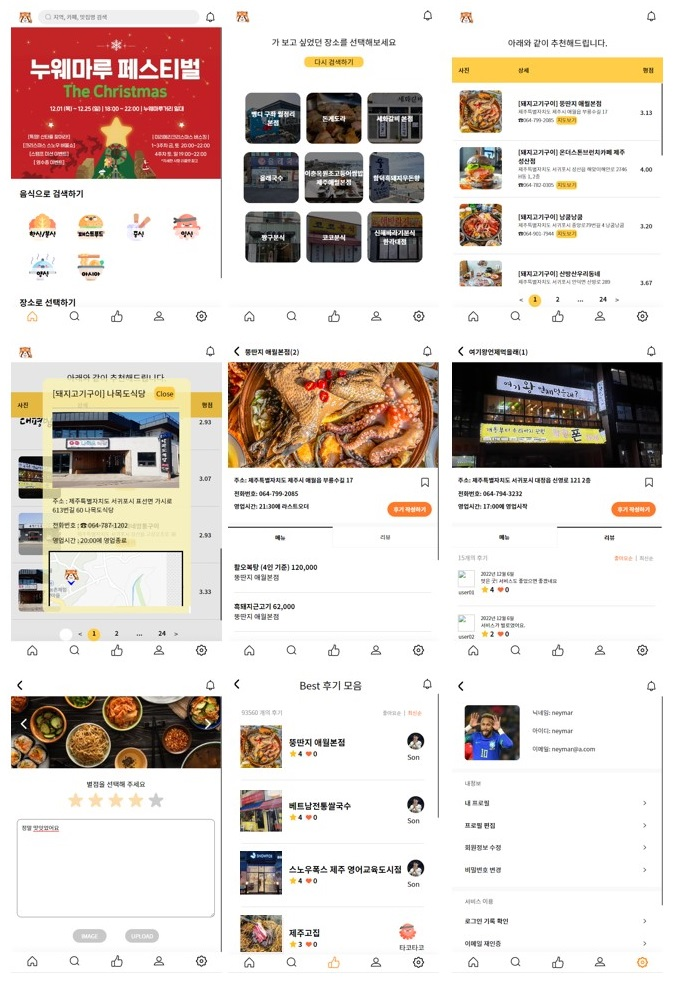
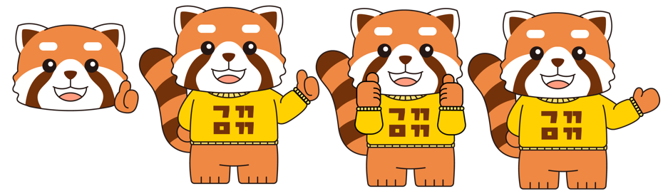

# B6팀(나이사)_가까?마까?(GaggaMagga) 프로젝트

 

## ****📌 프로젝트 개요****

  - **기획 의도**
    - 누구나 여행을 떠나서 음식점을 가거나, 점심 식사 메뉴를 정할 때 고민이 있었던 경험이 있을 것 입니다.
    - 본 서비스는 '제주도' 라는 특정 지역에서 먹고자 하는 음식의 종류나 장소를 선택하면 사용자에게 맛집을 추천하고 있습니다.
    - 추천 기능은 머신러닝 유저기반 추천 기능을 활용하여 사용자와 가장 유사한 경험을 갖고 있는 사용자의 데이터들를 통해 음식점을 추천합니다.
    - 방문한 맛집은 다른 사용자와 후기를 공유하고, 후기에는 별점을 넣어 장소별 평가점수를 관리할 수 있습니다.
    - 각 후기에는 댓글과 대댓글 기능으로 유저간 경험을 공유할 수 있는 플랫폼을 제공합니다.
    - 마음에 드는 장소는 북마크하여 저장하고, 성향이 잘 맞는 유저는 팔로우하여 해당 유저의 경험을 공유받을 수 있는 서비스를 구성하였습니다.
  - **개발기간** : '22.11.30 ~ 12.29
 

## 🥘 ****주요 페이지****

 

## ⚙ ****기능 명세서****

  - 사용자 환경(회원가입, 로그인, 회원정보 관리, 팔로우, 비활성화, 아이디/비밀번호 찾기)
  - 맛집 후기(리뷰) 작성/수정/삭제, 조회수 카운트, 좋아요, 검색 기능  
  - 후기 댓글 작성/수정/삭제
  - 후기 댓글의 대댓글 작성/수정/삭제 기능
  - 유저간 댓글, 후기의 좋아요 알림 기능
  - HTML/CSS/Javascript를 활용한 반응형 모바일 프론트엔드 페이지 구성

 

## 🔨 ****개발 포지션 구성****

  🛠**사재혁**
  - 유저 관리, 프로필, 개인설정 및 추가 기능
  - Docker, AWS 배포

  🛠**장진**
  - 머신러닝 장소 추천 기능, 후기 조회수, 페이지네이션

  🛠**나웅주**
  - 리뷰 조회 페이지, Best 리뷰 페이지 

  🛠**이지영**
  - 북마크 기능, 좋아요 기능, 댓글/대댓글 기능 

  🛠**이금빈**
  - 리뷰 생성 페이지, 팔로우 기능, 알림 기능, 검색 기능
  - Docker, AWS 배포

 

## ****⛓ Tech Stack****  

### Backend :   
### Frontend :    
### Server :    
### Management :  

 

## 📚 ****Used API, Dataset****
  - **소셜로그인** : KAKAO Oauth2 API
  - **계정 찾기** : NAVER Cloud SMS API
  - **지도 App** : NAVER Web Dynamic Map API
  - **검색 App** : ALGOLIA API
  - **맛집 Data** : NAVER Map v5.0 crawling Data

 

## 🧱 ****Project Architecture****

 

## 🕸 ****Wireframe****

 

## 🛢 ****Database ERD****

### [ERD cloud link](https://www.erdcloud.com/d/RvXb4PCLq3t3CPb3e)

 

## 🎯 ****API****
### [USER API](https://www.notion.so/ea5288cd6b724843aba84b78b367cf2a)

### [PLACE API](https://www.notion.so/77cdb6c85d724d59a46e38b6d4f307ee)

### [REVIEW API](https://www.notion.so/6699ab1af4524a04ac4d44bad3294938)

### [NOTIFICATION API](https://www.notion.so/783dbdb9d49d413ea8167fa98b5dc4ea)

 

## 🐾 ****Main Character****

 

## 🤙 ****Convention****

- :sparkles:Feat: 새로운 기능 추가
- :bug:Fix: 버그 수정
- :ambulance:!HOTFIX: 급한 오류 수정
- :books:Docs: 문서 수정
- :umbrella:Test: 테스트 코드 추가
- :hammer:Refact: 코드 리팩토링
- :art:Style: 코드 의미에 영향을 주지 않는 변경사항
- :lipstick:Design: CSS 등 사용자 UI디자인 변경
- Comment: 필요한 주석 추가 및 변경	
- Rename: 파일 혹은 폴더명을 수정하거나 옮기는 작업만의 경우
- Remove: 파일을 삭제하는 작업만 수행한 경우
- Chore: 빌드 부분 혹은 패키지 매니저 수정사항

 

## 🙏 ****Ground Rules****

- 하루에는 정해진 시간 안에 개발을 완료할 수 있도록 한다. (오전 9시 ~ 오후 10시)
- 깃 컨벤션을 지키고, 깃허브 프로젝트, 이슈 및 마일스톤을 활용하여 협업한다.
- 정기 회의체를 유지한다.(2회/일, 1차-10시, 2차-20시)

 

### [Front-end Page](https://github.com/1TEAM12/GaGgaMaGga_FE)
### [Swagger API Docs](http://3.36.51.98/)
### [노션 진행 상황](https://www.notion.so/11-30-12-29-482dc47b71d44e968cf32283bb422238)
