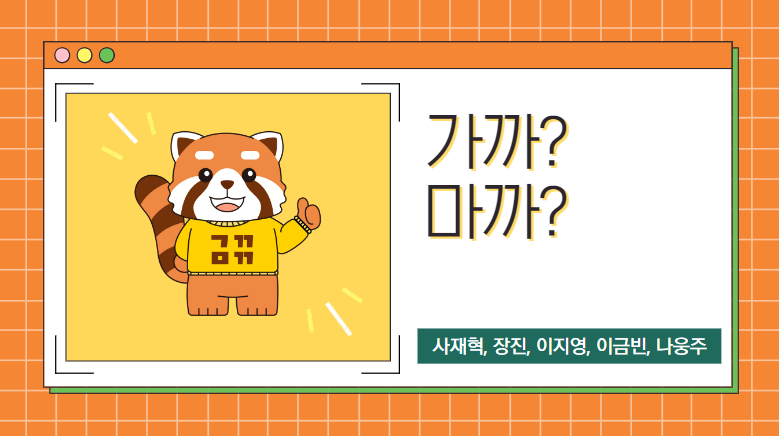
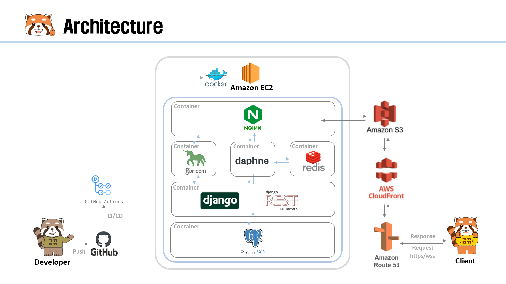
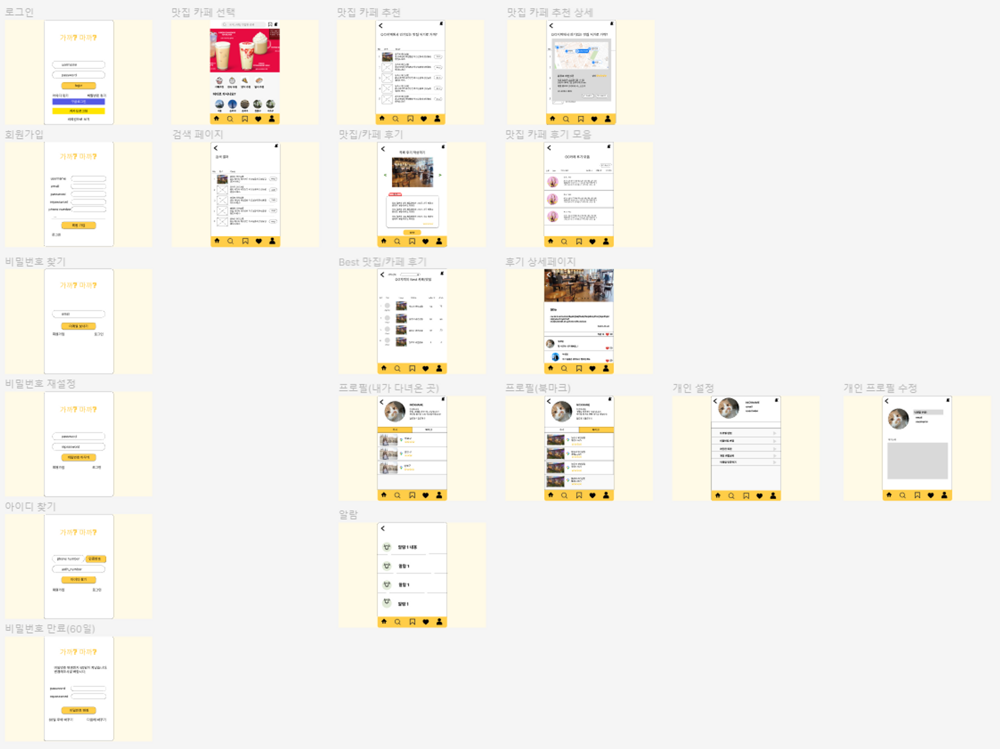
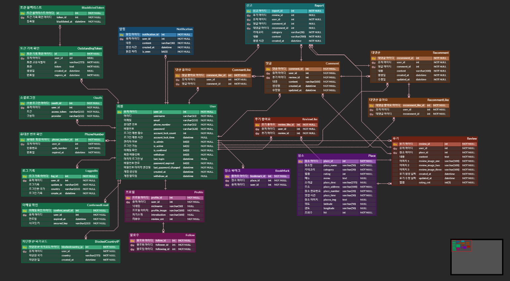
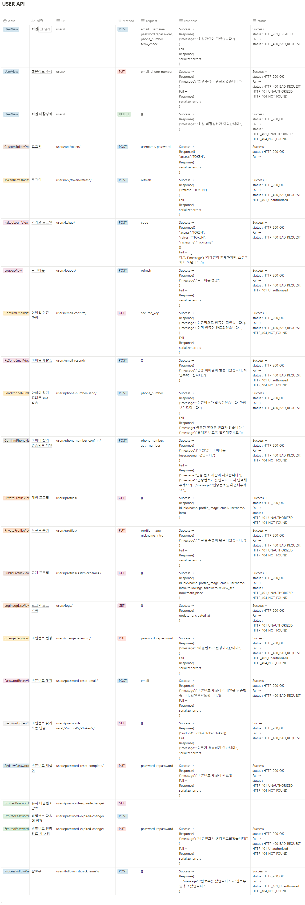
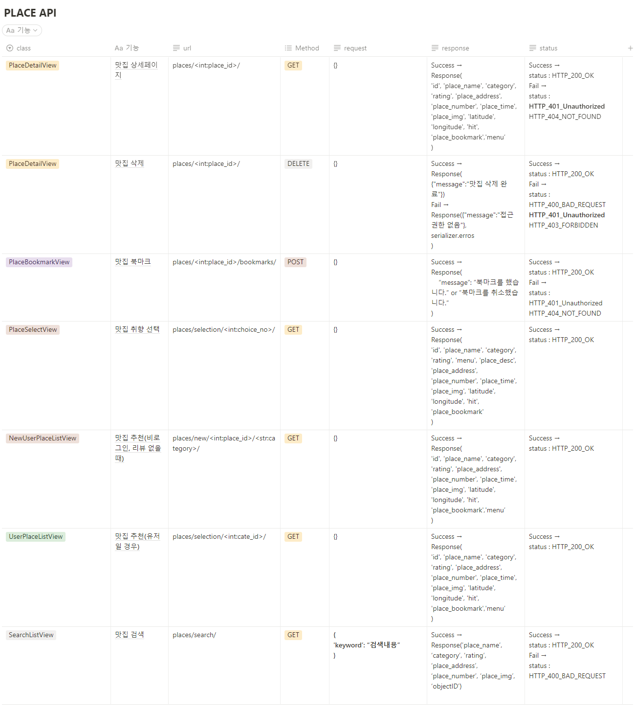
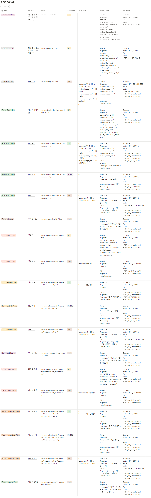
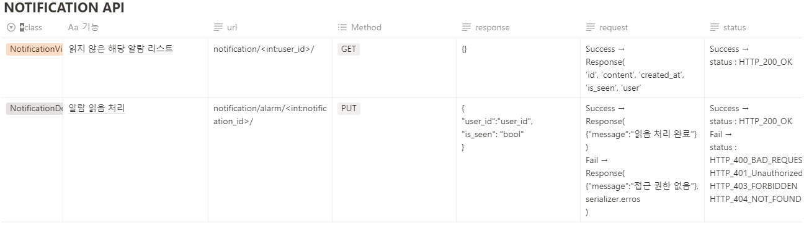

# 가까?마까?(GaggaMagga) 프로젝트 

 

## ****📌 프로젝트 개요****

기획 의도

- 누구나 여행을 떠나서 음식점을 가거나, 점심 식사 메뉴를 정할 때 고민이 있었던 경험이 있을 것 입니다.
- 본 서비스는 '제주도' 라는 특정 지역에서 먹고자 하는 음식의 종류나 장소를 선택하면 사용자에게 맛집을 추천하고 있습니다.
- 추천 기능은 머신러닝 유저기반 추천 기능을 활용하여 사용자와 가장 유사한 경험을 갖고 있는 사용자의 데이터들를 통해 음식점을 추천합니다.
- 방문한 맛집은 다른 사용자와 후기를 공유하고, 후기에는 별점을 넣어 장소별 평가점수를 관리할 수 있습니다.
- 각 후기에는 댓글과 대댓글 기능으로 유저간 경험을 공유할 수 있는 플랫폼을 제공합니다.
- 마음에 드는 장소는 북마크하여 저장하고, 성향이 잘 맞는 유저는 팔로우하여 해당 유저의 경험을 공유받을 수 있는 서비스를 구성하였습니다.

  

  
개발기간 : '22.11.30 ~ 12.29'

 

## 🥘 ****서비스 시연 영상****

 

 

## ⚙ ****기능 명세서****

  - 사용자 환경(회원가입, 로그인, 회원정보 관리, 팔로우, 비활성화, 아이디/비밀번호 찾기 등등)
  - 맛집 후기(리뷰) 작성/수정/삭제, 조회수 카운트, 좋아요, 검색 기능  
  - 후기 댓글 작성/수정/삭제
  - 후기 댓글의 대댓글 작성/수정/삭제 기능
  - 유저간 댓글 알림 기능

 

## 🔨 ****개발 포지션 구성****
  
  

    
🛠 사재혁(팀장)

    

  
  - 유저 관리, 프로필, 개인설정 및 추가 기능
  - user 테스트 코드
  - Docker, AWS 배포
  - CI/CD 구축
  - 코드 리팩토링/Swagger 적용

  

  
   

    
🛠 장진

    

  
  - 머신러닝 장소 추천 기능, 후기 조회수, 페이지네이션
  - place 테스트 코드
  - CI/CD 구축

  

  
  

  
🛠 나웅주

  

  
  - 리뷰 조회 페이지, Best 리뷰 페이지 

  

  

  
🛠 이지영

  

  
  - 북마크 기능, 좋아요 기능, 댓글/대댓글 기능 
  - review 테스트 코드

  

  
  

  
🛠 이금빈

  

  
  - 리뷰 생성 페이지, 팔로우 기능, 알림 기능, 검색 기능
  - notification 테스트 코드
  - Docker, AWS 배포

  

 

## ****⛓ Tech Stack****  

### Backend :   
### Server :       
### Management :   
### Database : 

 

## 📚 ****Used API, Dataset****
  - **소셜로그인** : KAKAO Oauth2 API
  - **계정 찾기** : NAVER Cloud SMS API
  - **지도 App** : NAVER Web Dynamic Map API
  - **검색 App** : ALGOLIA API
  - **IP 정보 확인** : Whois API
  - **맛집 Data** : NAVER Map v5.0 crawling Data
  

 

## 🧱 ****Project Architecture****

 

## 🕸 ****[Wireframe](https://www.figma.com/file/dlmax1N0WmxIWkeoxWMWCs/%EC%B5%9C%EC%A2%85-%ED%94%84%EB%A1%9C%EC%A0%9D%ED%8A%B8?node-id=0%3A1&t=0TMnEGrfJz1zCmk7-0)****

 

## 🛢 ****[Database ERD](https://www.erdcloud.com/d/RvXb4PCLq3t3CPb3e)****

 

## 🎯 ****Notion API**** | ****[Swagger API Docs](https://www.gaggamagga.tk)****

USER API

PLACE API

REVIEW API
 

NOTIFICATION API

 

## 🤙 ****Test Code Case****

USER TEST CODE

## 회원가입
1. 회원가입 성공
2. 회원가입 실패(이메일 빈칸)
3. 회원가입 실패(이메일 형식)
4. 회원가입 실패(이메일 중복)
5. 회원가입 실패(아이디 빈칸)
6. 회원가입 실패(아이디 유효성검사)
7. 회원가입 실패(아이디 중복)
8. 회원가입 실패(비밀번호 빈칸)
9. 회원가입 실패(전화번호 중복)
10. 회원가입 실패(비밀번호확인 빈칸)
11. 회원가입 실패(비밀번호, 비밀번호 확인 일치 )
12. 회원가입 실패(비밀번호 유효성 검사(simple))
13. 회원가입 실패(비밀번호 유효성검사(동일))
14. 회원가입 실패(약관동의)

## 회원정보 수정/비활성화
15. 회원정보 수정 성공
16. 회원정보 수정 실패(이메일 빈칸)
17. 회원정보 수정 실패(이메일 중복)
18. 회원정보 수정 실패(이메일 형식)
19. 회원정보 수정 실패(휴대폰번호 중복)
20. 회원 비활성화 

## 로그인
21. (access token)로그인 성공
22. (access token)로그인 실패
23. (access token 여러번 시도)로그인 실패
24. (refresh_token)로그인 성공
25. (refresh_token)로그인 실패(refresh 입력안했을 때)
26. (refresh_token)로그인 실패(access 토큰 넣었을 때)

## 로그아웃
27. (refresh_token)로그아웃 성공
28. (refresh_token)로그아웃 실패(refresh 입력안했을 때)
29. (refresh_token)로그아웃 실패(access 토큰 넣었을 때)
30. 일괄 로그아웃 성공

## 토큰 유효 확인
31. access 토큰 유효 (성공)
32. refresh 토큰 유효 (성공)
33. 토큰 유효하지 않음 (실패)

## 이메일 인증 확인
34. 이메일 인증 확인 성공
35. 이메일 인증 확인 실패

## 이메일 재인증
36. 이메일 재인증 성공
37. 이메일 재인증 실패

## 아이디 찾기(인증번호)
38. 인증번호 보내기 성공
39. 인증번호 보내기 실패
40. 인증번호 확인 성공
41. 인증번호 확인 실패

## 프로필
42. 개인 프로필 조회
43. 개인 프로필 수정 성공
44. 개인 프로필 수정 실패(닉네임 유효성검사)
45. 개인 프로필 수정 실패(닉네임 중복)
46. 공개 프로필 조회
47. 로그인 기록
48. IP 국가코드 차단 읽기 성공
49. IP 국가코드 차단 성공
50. IP 국가코드 차단 실패 (국가 코드 중복)
51. IP 국가코드 차단 실패 (국가 코드 빈칸)
52. IP 국가코드 차단 삭제

## 비밀번호 변경
53. 비밀번호 변경 성공
54. 비밀번호 변경 실패(현재 비밀번호 빈칸)
55. 비밀번호 변경 실패(현재 비밀번호 불일치)
56. 비밀번호 변경 실패(비밀번호 빈칸)
57. 비밀번호 변경 실패(비밀번호 확인 빈칸)
58. 비밀번호 변경 실패(비밀번호 현재비밀번호와 동일시)
59. 비밀번호 변경 실패(비밀번호 유효성검사(simple))
60. 비밀번호 변경 실패(비밀번호 유효성검사(동일))
61. 비밀번호 변경 실패(비밀번호, 비밀번호 확인 일치)

## 비밀번호 찾기
62. 비밀번호 찾기 실패(존재하지 않는 이메일전송)
63. 비밀번호 찾기 실패(형식에 맞지 않는 이메일 전송)
64. 비밀번호 찾기 실패(이메일 빈칸일 때 이메일 전송)

## 비밀번호 토큰 인증
65. 비밀번호 토큰 인증 성공
66. 비밀번호 토큰 인증 실패
## 비밀번호 분실시 재설정
67. 비밀번호 분실시 재설정 성공
68. 비밀번호 분실시 재설정 실패(비밀번호 빈칸)
69. 비밀번호 분실시 재설정 실패(비밀번호 확인 빈칸)
70. 비밀번호 분실시 재설정 실패(비밀번호 유효성검사(simple))
71. 비밀번호 분실시 재설정 실패(비밀번호 유효성검사(동일))
72. 비밀번호 분실시 재설정 실패(비밀번호, 비밀번호 확인 일치)
73. 토큰이 다를 경우

## 비밀번호 만료
74. 비밀번호 만료시 확인
75. 비밀번호 만료시 다음에 변경
76. 비밀번호 만료시 변경 성공
77. 비밀번호 만료시 변경 실패(현재 비밀번호 빈칸)
78. 비밀번호 만료시 변경 실패(현재 비밀번호 불일치)
79. 비밀번호 만료시 변경 실패(비밀번호 빈칸)
80. 비밀번호 만료시 변경 실패(비밀번호 확인 빈칸)
81. 비밀번호 만료시 변경 실패(비밀번호 유효성검사(simple))
82. 비밀번호 만료시 변경 실패(비밀번호 유효성검사(동일))
83. 비밀번호 만료시 변경 실패(비밀번호, 비밀번호 확인 일치)

## 팔로우 성공
84. 팔로우 기능 성공
85. 팔로우 기능 실패(본인 팔로우 했을 때)

PLACE TEST CODE

## 맛집 카테고리 선택
1. 카테고리 선택(음식 선택 - 비로그인 계정)
2. 카테고리 선택(장소 선택 - 비로그인 계정)

## 맛집 리스트 추천
3. 맛집 리스트 불러오기(음식 선택 - 비로그인 계정)
4. 맛집 리스트 불러오기(장소 선택 - 비로그인 계정)
5. 맛집 리스트 불러오기(음식 선택 - 로그인 계정)
6. 맛집 리스트 불러오기(장소 선택 - 로그인 계정)

## 맛집 상세페이지
7. 맛집 상세페이지 조회
8. 맛집 삭제(관리자 계정)
9. 맛집 삭제 실패(비관리자 계정)
10. 맛집 북마크(유저일 때)
11. 맛집 검색

REVIEW TEST CODE

## 비로그인 계정, 로그인 계정(리뷰X), 카카오계정(리뷰X)
1. 리뷰 전체 조회(Best리뷰)
2. 맛집 리뷰 조회

## 리뷰 작성
3. 리뷰 작성(이미지X)
4. 리뷰 작성(이미지O)
5. 리뷰 작성 실패(비로그인 유저)
6. 리뷰 작성 실패(리뷰 내용이 빈칸)
7. 리뷰 작성 실패(리뷰 평점이 빈칸)

## 리뷰 수정
8. 리뷰 수정 내용 조회
9. 리뷰 수정(이미지X)
10. 리뷰 수정(이미지O)
11. 리뷰 수정 실패(비로그인 유저)
12. 리뷰 수정 실패(리뷰 내용이 빈칸)
13. 리뷰 수정 실패(리뷰 평점이 빈칸)
14. 리뷰 수정 실패(리뷰 작성자 불일치(작성자 user1))

## 리뷰 삭제
15. 리뷰 삭제 실패(비로그인 유저)
16. 리뷰 삭제 실패(리뷰 작성자 불일치(작성자 user1))

## 리뷰 신고
17. 리뷰 신고 
18. 리뷰 신고 실패(비로그인 유저)
19. 리뷰 신고 실패(작성자가 신고)
20. 리뷰 신고 실패(중복 데이터)
21. 리뷰 신고 실패(신고 내용 빈칸)
22. 리뷰 신고 실패(신고 카테고리 빈칸)

## 리뷰 좋아요
23. 리뷰 좋아요
24. 리뷰 좋아요 실패(비로그인 유저)

## 댓글 조회/작성
25. 해당 리뷰의 댓글 조회 성공
26. 댓글 작성 성공
27. 로그인 안된 유저가 시도했을때 에러나오는지
28. 댓글 작성 실패(댓글 내용이 빈칸)

## 댓글 수정
29. 댓글 수정 성공
30. 댓글 수정 실패(비로그인 유저)
31. 댓글 수정 실패(댓글 수정 내용이 빈칸)
32. 댓글 수정 실패(리뷰 작성자 불일치(작성자 user1))

## 댓글 삭제
33. 댓글 삭제
34. 댓글 삭제 실패(비로그인 유저)
35. 댓글 삭제 실패(댓글 작성자(user1)와 삭제 유저(user2)불일치)

## 댓글 신고
36. 댓글 신고 
37. 댓글 신고 실패(비로그인 계정)
38. 댓글 신고 실패(작성자가 신고)
39. 댓글 신고 실패(중복 데이터)
40. 댓글 신고 실패(신고 내용 빈칸)
41. 댓글 신고 실패(신고 카테고리 빈칸)

## 댓글 좋아요
42. 댓글 좋아요
43. 댓글 좋아요 실패(비로그인 계정)

## 대댓글 조회/작성
44. 해당 댓글의 대댓글 조회 성공
45. 대댓글 작성 성공
46. 로그인 안된 유저가 시도했을때 에러나오는지
47. 대댓글 작성 실패(대댓글 내용이 빈칸)

## 대댓글 수정
48. 대댓글 수정
49. 대댓글 수정 실패(비로그인 유저)
50. 대댓글 수정 실패(댓글 수정내용이 빈칸)
51. 대댓글 수정 실패(리뷰 작성자 불일치(작성자 user1))

## 대댓글 삭제
52. 대댓글 삭제
53. 대댓글 삭제 실패(비로그인 유저)
54. 대댓글 삭제 실패(대댓글작성자(user1)와 삭제유저(user2)불일치)

## 대댓글 신고
55. 대댓글 신고
56. 대댓글 신고 실패(비로그인 유저)
57. 대댓글 신고 실패(작성자가 신고)
58. 대댓글 신고 실패(중복 데이터)
59. 대댓글 신고 실패(신고 내용 빈칸)
60. 대댓글 신고 실패(신고 카테고리 빈칸)

## 대댓글 좋아요
61. 대댓글 좋아요
62. 대댓글 좋아요 실패(비로그인 유저)

NOTIFICATION TEST CODE

## 알람 기능
1. 알람 리스트 조회
2. 알람 읽음 처리

 

## 🔗 ****Link**** 
### [Front-end Repository](https://github.com/1TEAM12/GaGgaMaGga_FE)
### [Notion 현황판 & 트러블 슈팅](https://liberating-engineer-32d.notion.site/11-30-12-29-482dc47b71d44e968cf32283bb422238)
### [배포 사이트](http://gaggamagga.shop/)
